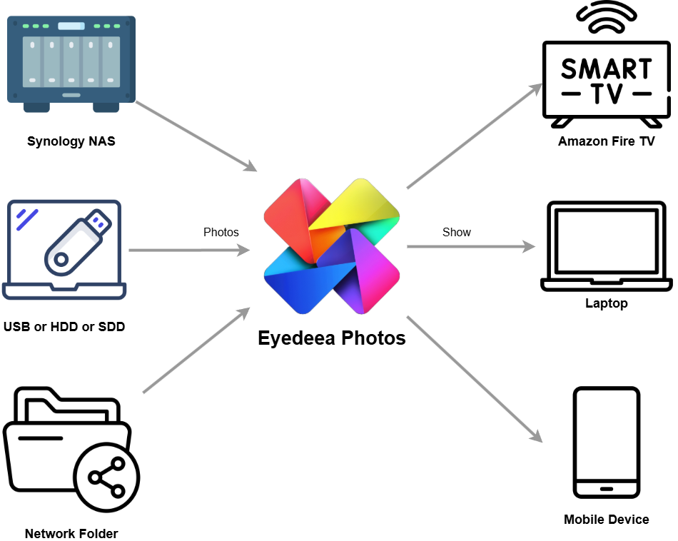
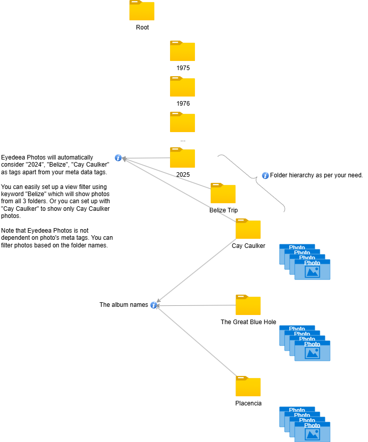

# Rediscover Your Photos

## The Problem: Viewing and Sharing My Photos
Storing photos efficiently is great, but what's the use if I can't easily view and share them? I don’t want to just send folders of images via email—I want a seamless way to rediscover and showcase my memories.

## The Solution: Eyedeea Photos

**Eyedeea Photos** is an app designed to bring forgotten memories back to life. It integrates with **Synology Photos** & any USB, HDD, SDD to display random photos from the collection. Here’s how it works:
- **Scan:** Interacts with **Synology Photos API** to extract metadata (filename, path, date taken, geolocation, album name, etc.).
- **Show:** Displays random photos across devices.

Currently, Eyedeea Photos runs on a **Raspberry Pi** within my home network, making photos easily accessible on TVs, laptops, and mobile devices. However, it's a tiny website (~125MB) that can be deployed on any laptop or desktop.

With this setup, my photos are **secure, organized, and easily viewable**—giving me peace of mind and a better way to enjoy my memories. No hefty cloud fees, no privacy concerns—just my photos, my way.

## Technical Details:
- **Written in Node.js** with a **Synology Photo API wrapper** that scans the photo repository and extracts metadata into a flattened structure.
- **Metadata stored in SQLite DB**, allowing easy updates to album names, date taken, and marking photos for future edits.
- **Storage agnostic:** Can be extended to read from external sources like USB, HDD, or other service providers through plugins. I am planning to write a **File System plugin** to support USB and external SSDs/HDDs very soon.

## Feature Breakdown:
| Feature | Details | Technology | Status |
|---------|---------|------------|--------|
| **Basic Photo Player** | Scans photos, random playback, filtered playback, search, configurable scan times, display duration, and logs | Node.js, SQLite, PM2, Apache | Development |
| **MetaFix** | Updates metadata (tags, taken-on date, EXIF, album movement) | Python, ExifTool | Incubation |
| **Duplicate Identification** | Detects and marks duplicate photos | Python | Requested |
| **Out-of-Focus Detection** | Identifies and marks blurry photos | Python | Requested |

## Scope and Considerations:
- **Not a photo management app:** Users must handle organization, metadata updates, and deletions themselves.
- **No warranty:** Users assume full responsibility for any issues.
- **Built for home networks:** No authentication system is currently implemented.
- **Primary focus is display:** Users must collect and arrange photos beforehand.

## Current State:
- **MVP deployed on Raspberry Pi 5**, regularly used on two **Amazon FireStick** devices via the **Silk Browser**. FireStick sleep timeout disabled using ADBLink.
- **Personal Results:**
  - **42,000 photos identified**, **12,000 duplicates removed**
  - Corrected multiple album names (**album names inferred from folder names, with formatting improvements**)
  - **Scanning 30,000 photos takes ~10 minutes**
- **Family Impact:**
  - Enjoy random memories resurfacing.
  - Easily spot incorrect albums and duplicates.
  - Discover surprising, long-forgotten moments.

## Eyedeea Photos Diagram:

## Folder Structure
My folder structure looks as follows, but the code should traverse through any folder structure.
- It takes about **10 mins** to parse my folders with **30K photos**. I started with **42K photos**, but **Eyedeea Photos** helped me identify **12K duplicates**.

## Why NAS?
If you find these questions intriguing, keep reading:
- Where do you store your photos?
- Do you know how many photos you have?
- How often do you revisit your entire collection?
- How much are you paying for cloud storage?

Most of us sync our photos to one or more cloud providers. They lure us in with free storage, only to charge hefty fees as our collections grow. Their business model revolves around two things:
1. Leveraging our data to train AI models and develop new tools.
2. Charging for storage.

While businesses need to make a profit, the real concern for me is **privacy** - I don’t want my photos stored with someone else. As a tech enthusiast, I could go into more details, but let’s keep it simple.

## My Concerns:
- **Privacy Risks:** Cloud providers scan photos for metadata—faces, locations, timestamps. With this data, someone could map out my travel history.
- **Duplicate Photos:** Multiple services prompt me to sync my photos, creating redundancy.
- **Disorganization:** I often find myself drowning in photos, unsure of how many I have. If I can't easily access and enjoy them, what’s the point of storing them?
- **Limited Sharing Options:** I want to regularly view and share my photos with friends and family across different devices—TV, laptop, mobile.
- **Multiple Providers:** Due to varying features and costs, I can’t rely on a single cloud provider.

## The Solution: Take Control of Your Photos
### 1. NAS Storage
I built my own **Network Attached Storage (NAS)** using a **Synology DS923+**, ensuring data redundancy and high availability. My photos are accessible within my home network and remotely—without recurring fees or third-party dependencies.

### 2. Geo-Redundancy for Backup
To mitigate risks like natural disasters, I use two backup strategies:
- **Cloud Backup:** I back up my NAS to affordable cloud storage like **AWS S3 Deep Glacier** ($0.0036 per GB/month).
- **Physical Backup:** I periodically copy encrypted backups onto **external SSDs/HDDs** and store them in a separate location.

I also declutter my collection by removing duplicates and keeping only meaningful photos. Currently, I have **32,000 photos (~100GB)**, and I expect to stay under **1TB** for years, making cloud backup affordable (~$50 per TB per year).

## Conclusion
With this setup, my photos are **secure, organized, and easily viewable**—giving me peace of mind and a better way to enjoy my memories. No hefty cloud fees, no privacy concerns—just **my photos, my way**.

## Credits:
- **Website Template:** https://html5up.net
- **Synology API Documentation** [at github by zeichensatz](https://github.com/zeichensatz/SynologyPhotosAPI)